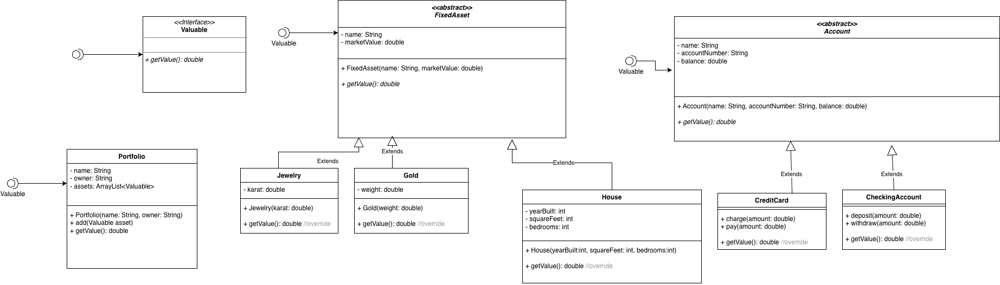

# Portfolio Manager
## Class Design



## Requirements


## Code 
### Interesting Code


```` Java
 public CreditCard(String name, String accountNumber, double balance) {
        this.name = name;
        this.accountNumber = accountNumber;
        this.balance = balance;
````


